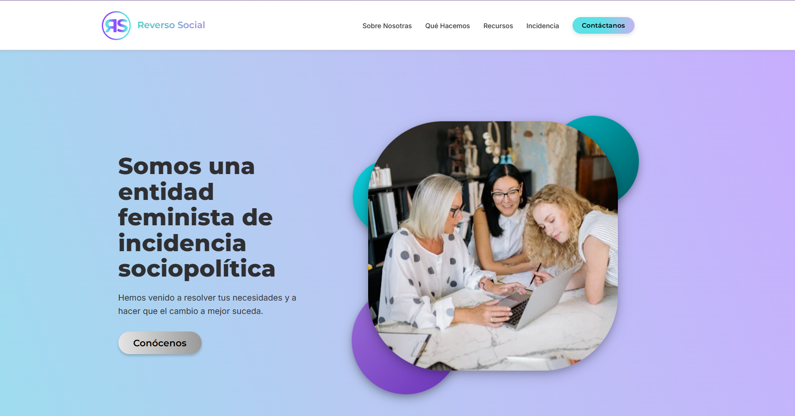
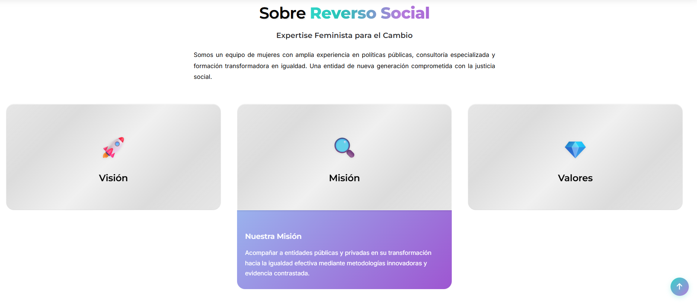
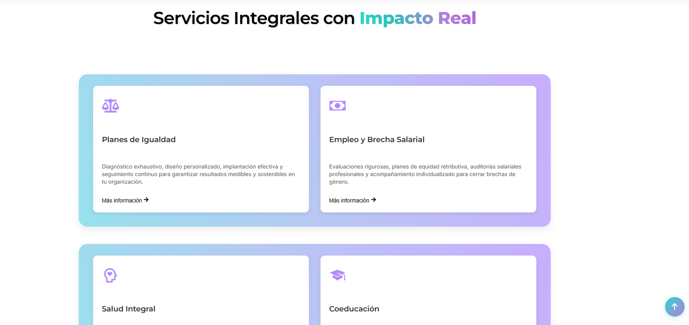
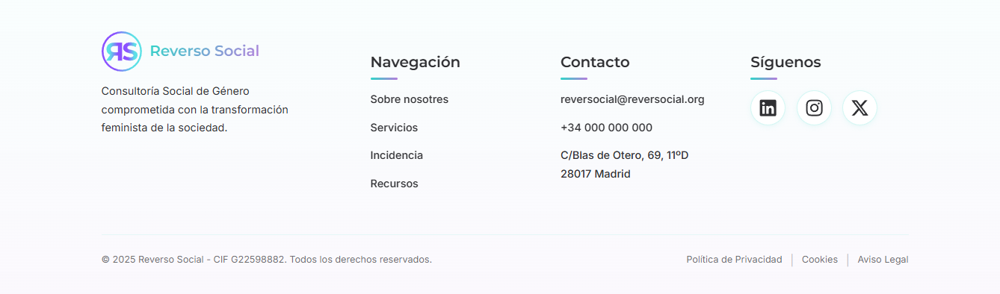

# Reverso Social – Frontend (Sprint 1)

Este repositorio contiene el **frontend del proyecto Reverso Social**, desarrollado con **React (JavaScript)** durante el **Sprint 1**.  
En esta primera entrega se construyó la estructura base del proyecto, los componentes principales de la interfaz y los estilos iniciales utilizando **SASS**.

---

## 🚀 Tecnologías utilizadas

- **React JS**
- **JavaScript (ES6+)**
- **Vite** como bundler
- **SASS / SCSS** para los estilos
- **React Router (si aplica)**
- **ESLint** para estándares de código

---

## 📁 Estructura del proyecto

La estructura principal del directorio `src/` quedó organizada de la siguiente manera:

src
│
├── assets/ # Imágenes, íconos, recursos estáticos
│
├── components/ # Componentes reutilizables de la UI
│ ├── About/
│ ├── Background/
│ ├── ContactModal/
│ ├── Footer/
│ ├── Header/
│ ├── Hero/
│ ├── NavBar/
│ ├── ScrollToTop/
│ ├── ServicesSection/
│ └── TeamSection/
│
├── pages/ # Páginas principales
│ ├── HomePage/
│ └── ResourcesPage/
│
├── styles/ # Estilos globales y configuración SASS
│ ├── _layout.scss
│ ├── _mixins.scss
│ ├── _typography.scss
│ ├── _variables.scss
│ └── main.scss
│
├── App.jsx
├── main.jsx
│
├── index.html
└── vite.config.js
Cada componente y página cuenta con sus **dos archivos correspondientes**:  
- `Nombre.jsx` → Componente funcional  
- `Nombre.scss` → Estilos específicos del componente

---

## 🎯 Objetivos del Sprint 1

✔ Crear la estructura base del proyecto con Vite  
✔ Configurar SASS y crear arquitectura inicial de estilos (variables, mixins, layout, tipografía)  
✔ Implementar los primeros componentes básicos del landing page  
✔ Crear las páginas iniciales: **HomePage** y **ResourcesPage**  
✔ Añadir la navegación principal  
✔ Dejar preparado el proyecto para escalar en futuros sprints  

---

## 🖥️ Scripts disponibles

En el directorio raíz puedes ejecutar:

### `npm install`
Instala todas las dependencias necesarias del proyecto.

### `npm run dev`
Levanta el entorno de desarrollo con Vite.

### `npm run build`
Genera la versión optimizada para producción.

### `npm run preview`
Sirve la build generada para revisión.

---

## 🧩 Componentes implementados (Sprint 1)

- Header  
- NavBar  
- Hero  
- About  
- ServicesSection  
- TeamSection  
- ContactModal  
- Footer  
- Background  
- ScrollToTop  

Todos cuentan con su respectivo archivo `.jsx` y `.scss`.

---

## 🖼️ Capturas de pantalla

A continuación se añaden algunas capturas del estado del proyecto en este sprint:

---

## 🛠️ Equipo

Frontend colaborativo del proyecto **Reverso Social** — Sprint 1.

| Nombre | GitHub | LinkedIn |
|--------|--------|----------|
| **Angela Bello** | [@AngelaBello-creator](https://github.com/AngelaBello-creator) | [Angela Bello](https://www.linkedin.com/in/angela-bello-developer/) |
| **Andrea Olivera** | [@andreaonweb](https://github.com/andreaonweb) | [Andrea Olivera Romero](https://www.linkedin.com/in/AndreaOliveraRomero) |
| **Gabi Gallegos** | [@hgall3](https://github.com/hgall3) | [Gabriela Gallegos Anda](https://www.linkedin.com/in/gabrielagallegosanda/) |
| **Erika Montoya** | [@DevErika](https://github.com/DevErika) | [Erika Montoya](https://www.linkedin.com/in/erikamontoya/) |
| **Luisa Moreno** | [@LuMorenoM](https://github.com/LuMorenoM) | [Luisa Moreno](https://www.linkedin.com/in/luisa-moreno-474334338/) |

---

## 📄 Licencia

Este proyecto es de uso interno para desarrollo académico/profesional del equipo y no posee licencia pública.

---
