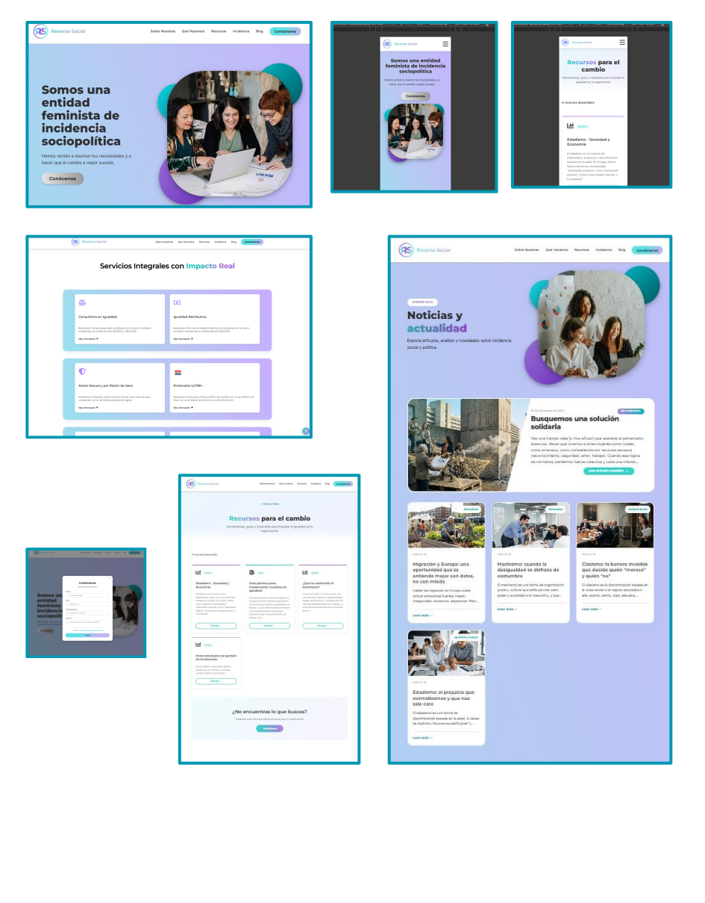

# Reverso Social – Frontend

This repository contains the **frontend of the Reverso Social project**, developed with **React (JavaScript)**.
In this initial release, the project structure, main UI components, and initial styles (using **SASS**) have been built.

---

## Technology Stack

| Technology       | Version   | Purpose                        |
|------------------|-----------|--------------------------------|
| **React**        | ^18.2.0   | Main UI Library                |
| **Vite**         | ^7.2.4    | Bundler and Dev Environment    |
| **SASS**         | ^1.96.0   | CSS Preprocessor               |
| **React Router** | ^7.10.1   | Routing                        |
| **Axios**        | ^1.13.2   | HTTP Client                    |
| **Vitest**       | ^4.0.15   | Testing Framework              |

### Backend (Reference)

The backend for this project is built with **Java and Spring Boot**.

| Technology       | Version   | Purpose                        |
|------------------|-----------|--------------------------------|
| **Java**         | 21        | Programming Language           |
| **Spring Boot**  | 3.4.12    | Main Framework                 |
| **PostgreSQL**   | -         | Relational Database            |
| **Spring Security**| -       | Security and Authentication    |
| **JWT**          | 4.4.0     | Tokens (Auth0)                 |
| **MapStruct**    | 1.5.5     | Object Mapping                 |
| **Lombok**       | 1.18.34   | Boilerplate Reduction          |

---

## Project Structure

The main structure of the `src/` directory is organized as follows:

```
src
│
├── api/             # Backend API logic
├── assets/          # Images, icons, static resources
├── components/      # Reusable UI components
│   ├── About/
│   ├── Background/
│   ├── BlogCard/
│   ├── ContactDetailModal/
│   ├── ContactModal/
│   ├── DownloadModal/
│   ├── Footer/
│   ├── GlobalModal/
│   ├── Header/
│   ├── Hero/
│   ├── LoginModal/
│   ├── NavBar/
│   ├── Pagination/
│   ├── ScrollToTop/
│   ├── SearchBar/
│   ├── SEO/
│   ├── ServicesSection/
│   ├── TeamSection/
│   └── UserMenu/
│
├── config/          # Configurations (e.g., axios)
├── data/            # Static or mock data
├── hooks/           # Custom hooks
├── pages/           # Main pages
│   ├── AdminDashboard/
│   ├── BlogDetail/
│   ├── BlogPage/
│   ├── HomePage/
│   ├── ResourcesPage/
│   └── ServiceDetails/
│
├── styles/          # Global styles and SASS configuration
│   ├── _layout.scss
│   ├── _mixins.scss
│   ├── _typography.scss
│   ├── _variables.scss
│   └── main.scss
│
├── tests/           # Unit and integration tests
├── App.jsx
├── main.jsx
```

Each component and page follows a **two-file structure**:
- `Name.jsx` → Functional Component
- `Name.scss` → Component-specific styles

## 🖥️ Available Scripts

In the root directory, you can run:

### `npm install`
Installs all necessary project dependencies.

### `npm run dev`
Starts the development environment with Vite.

### `npm run build`
Generates the optimized version for production.

### `npm run preview`
Serves the generated build for review.

---

## Deployment Instructions

To deploy the application in a production environment, follow these steps:

1. **Install dependencies:**
   Ensure Node.js is installed and run:
   ```bash
   npm install
   ```

2. **Build the project:**
   Generate static files optimized for production:
   ```bash
   npm run build
   ```
   This will create a `dist/` folder in the project root.

3. **Deploy:**
   The `dist/` folder contains all necessary static files (HTML, CSS, JS, images).
   
   - **Static Server:** You can upload the contents of `dist/` to any web server (Apache, Nginx, Vercel, Netlify, etc.).
   - **Local Preview:** To verify the build works correctly before uploading:
     ```bash
     npm run preview
     ```

---

## Team

**Reverso Social** Collaborative Frontend & Backend Team

| Name | GitHub | LinkedIn |
|--------|--------|----------|
| **Angela Bello** | [@AngelaBello-creator](https://github.com/AngelaBello-creator) | [Angela Bello](https://www.linkedin.com/in/angela-bello-developer/) |
| **Andrea Olivera** | [@andreaonweb](https://github.com/andreaonweb) | [Andrea Olivera Romero](https://www.linkedin.com/in/AndreaOliveraRomero) |
| **Gabi Gallegos** | [@hgall3](https://github.com/hgall3) | [Gabriela Gallegos Anda](https://www.linkedin.com/in/gabrielagallegosanda/) |
| **Erika Montoya** | [@DevErika](https://github.com/DevErika) | [Erika Montoya](https://www.linkedin.com/in/erikamontoya/) |
| **Luisa Moreno** | [@LuMorenoM](https://github.com/LuMorenoM) | [Luisa Moreno](https://www.linkedin.com/in/luisa-moreno-474334338/) |

---

## Screenshots

Below are some screenshots of the project state:




## License

This project is for internal use for the team's academic/professional development and does not have a public license.
